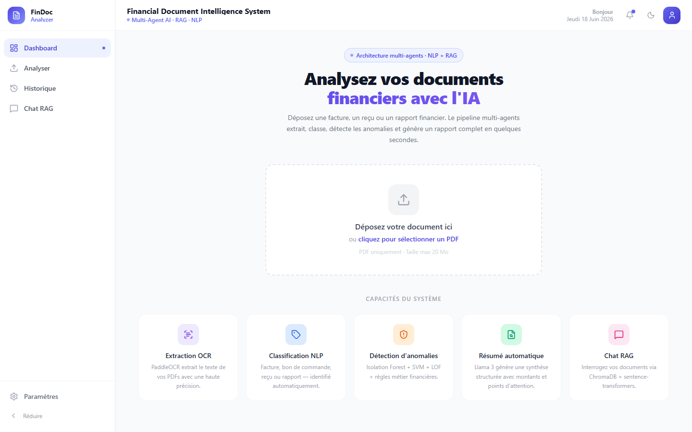
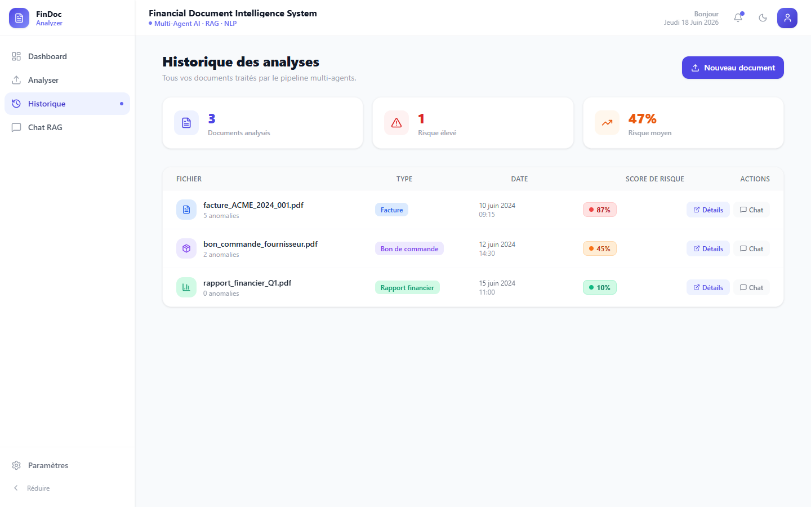
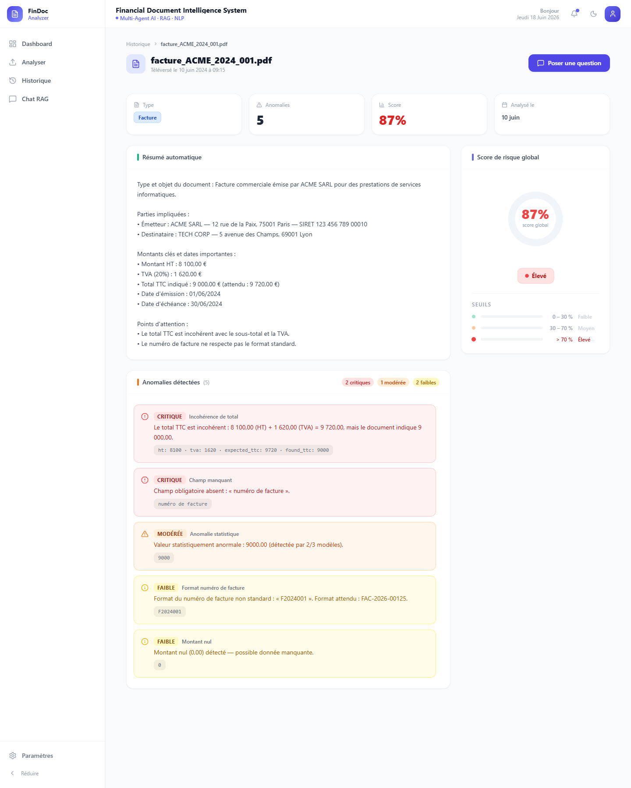
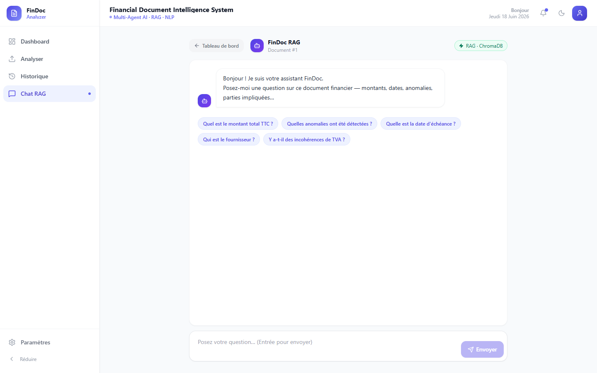

# FinDoc Analyzer AI

AI-powered full-stack platform for **financial document analysis**, combining OCR, NLP, anomaly detection, summarization and Retrieval-Augmented Generation (RAG) in a single workflow.

The project was developed as a Master's capstone project to explore how modern AI techniques can automate the extraction, understanding and analysis of financial documents.

---

## ✨ Main Features

- Upload and process financial documents
- OCR-based text extraction with PaddleOCR
- Document classification
- Named Entity Recognition with spaCy
- Structured field extraction
- Financial anomaly detection with Isolation Forest
- Automatic document summarization
- RAG-based question answering over uploaded documents
- Local LLM inference with Ollama / Llama 3
- Semantic search with Sentence Transformers and ChromaDB
- Document history and analysis dashboard
- User-facing chat interface
- REST API with FastAPI
- Dockerized full-stack deployment

---

## 🧠 AI Pipeline

```text
Financial Document
        │
        ▼
   OCR Extraction
   (PaddleOCR)
        │
        ▼
Document Classification
        │
        ▼
Information Extraction
  (spaCy / NLP)
        │
        ├──────────────► Anomaly Detection
        │                (Isolation Forest)
        │
        ├──────────────► Automatic Summary
        │
        └──────────────► RAG Pipeline
                         │
                         ▼
                 Embeddings + ChromaDB
                         │
                         ▼
                    Llama 3 / Ollama
```

---

## 🛠️ Tech Stack

### Frontend
- React
- Vite
- Tailwind CSS
- Axios
- React Router
- Recharts
- Framer Motion

### Backend
- Python
- FastAPI
- SQLAlchemy
- Pydantic
- Alembic

### AI & NLP
- PaddleOCR
- spaCy
- scikit-learn
- Isolation Forest
- LangChain
- LangGraph
- Sentence Transformers
- Ollama
- Llama 3

### Data & Infrastructure
- PostgreSQL
- ChromaDB
- Docker
- Docker Compose

---

## 🏗️ Architecture

```text
┌───────────────────┐
│   React Frontend  │
│      Vite UI      │
└─────────┬─────────┘
          │ REST API
          ▼
┌───────────────────┐
│  FastAPI Backend  │
└──────┬─────┬──────┘
       │     │
       │     ├────────────► PostgreSQL
       │
       ├──────────────────► ChromaDB
       │
       └──────────────────► Ollama / Llama 3

AI services:
OCR → Classification → NER → Anomaly Detection → Summary → RAG
```

---

## 📸 Application Preview

### Upload & document processing


### Document history


### Analysis dashboard


### RAG assistant


---

## 🚀 Run with Docker

### Requirements
- Docker
- Docker Compose

### 1. Clone the repository

```bash
git clone https://github.com/azizbg1/FinDoc-Analyser.git
cd FinDoc-Analyser
```

### 2. Create your environment file

```bash
cp .env.example .env
```

### 3. Start the application

```bash
docker compose up --build
```

Default services:

| Service | Address |
|---|---|
| Frontend | http://localhost:3000 |
| FastAPI backend | http://localhost:8000 |
| ChromaDB | http://localhost:8001 |
| Ollama | http://localhost:11434 |
| PostgreSQL | localhost:5432 |

---

## 💻 Local Development

### Backend

```bash
cd backend
python -m venv .venv
pip install -r requirements.txt
uvicorn app.main:app --reload
```

### Frontend

```bash
cd frontend
npm install
npm run dev
```

---

## 📂 Project Structure

```text
FinDoc-Analyser/
├── backend/
├── frontend/
├── screenshots/
├── presentation/
├── scripts/
├── docker-compose.yml
├── .env.example
└── README.md
```

---

## 🎯 Project Goal

FinDoc Analyzer AI aims to reduce the manual effort required to process financial documents by bringing together document understanding, anomaly detection and conversational AI.

The application demonstrates how a full-stack architecture can integrate traditional machine learning, NLP and LLM-based workflows into one practical document-analysis platform.

---

## 🔮 Future Improvements

- Multi-document batch processing
- Improved document classification
- More advanced anomaly-detection models
- Richer RAG evaluation and source attribution
- Additional financial document formats
- Role-based user management
- Production deployment and monitoring
- Automated testing and CI/CD

---

## 👨‍💻 Author

**Aziz Ben Guirat**  
Full-Stack Developer | Data & AI  
[GitHub Profile](https://github.com/azizbg1)
